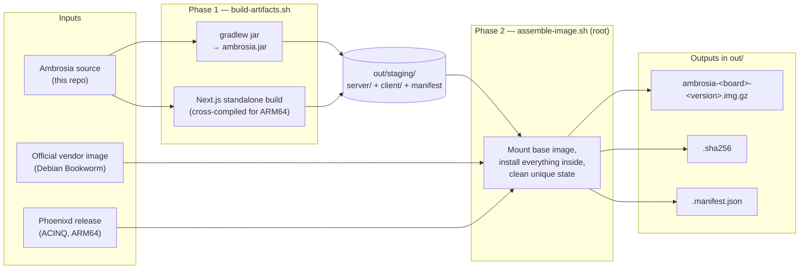
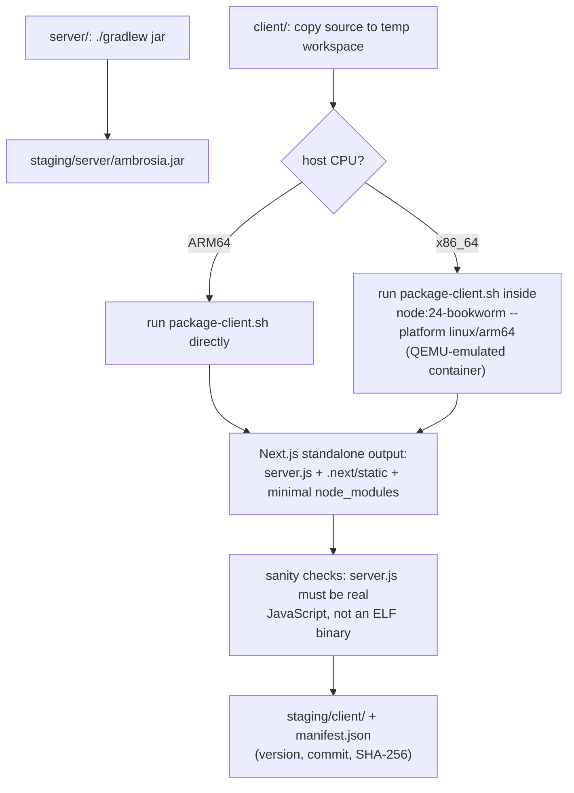
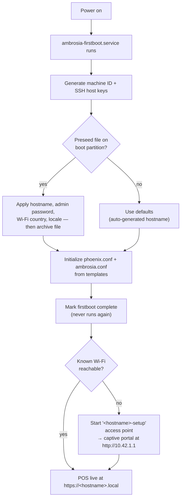

# How the image build works

A beginner-friendly walkthrough of what `hardware/image/build/` actually does, step by step. For the commands to run a build, see [`README.md`](README.md).

## The big picture

We do **not** build an operating system from scratch. We take the board vendor's official Debian image, open it up on the build machine as if it were a real disk, install the full Ambrosia stack inside it, wipe everything that must be unique per device, and compress the result. What comes out is a flashable SD card image that configures itself on first boot.



Two scripts, two phases:

| Phase | Script | Runs as | What it does |
|---|---|---|---|
| 1 | `build-artifacts.sh` | your user | Compiles the Kotlin server and the Next.js client into `out/staging/` |
| 2 | `assemble-image.sh` | root | Takes the vendor image + staging artifacts and assembles the final SD image |

`build-docker.sh` is just a wrapper that runs both phases inside a privileged Debian container — needed on macOS (no Linux kernel), convenient on Linux (keeps your host clean).

## Key concepts (glossary)

If these four ideas are clear, the rest of the pipeline is easy to follow:

- **Disk image (`.img`)** — a single file that is a byte-for-byte copy of an entire disk: partition table + partitions + filesystems. Flashing it with `dd` copies those bytes onto a real SD card.
- **Loop device (`losetup`)** — a Linux mechanism that makes a regular file behave like a block device (`/dev/loopN`). It lets us mount the partitions *inside* the `.img` file as if the SD card were plugged in.
- **chroot** — "change root": runs commands as if the mounted image's filesystem were `/`. That is how we run `apt-get install` *inside* the image without booting it.
- **QEMU user emulation (`qemu-aarch64-static`)** — the image contains ARM64 binaries, but the build machine is usually x86_64. Copying this emulator into the image lets the chroot execute ARM binaries transparently. Same trick, via Docker, lets Phase 1 compile the client's native ARM64 `node_modules` on an x86 host.

## Phase 0 — the board definition

Every supported board is a directory under `boards/<board-id>/` containing exactly three files:

```
boards/opi-zero-2w/
├── board.conf      # which vendor image, which phoenixd version, apt repos, runtime user
├── packages.txt   # flat list of Debian packages to install
└── README.md      # where to download the vendor image
```

The build scripts contain **no board-specific logic** — adding a new board means adding a new directory, nothing else.

## Phase 1 — build the Ambrosia artifacts



Why the ELF check? Some `node_modules` contain native binaries. If cross-compilation silently fails, you get x86 or corrupt files where JavaScript should be — and the device won't boot the client. The build refuses to continue if it detects that.

The version label comes from `git describe --tags` (falling back to `client/package.json`), overridable with `--version`.

## Phase 2 — assemble the image

This is the interesting part. Steps run in this exact order (see the bottom of `assemble-image.sh`):

```mermaid
flowchart TD
    P["1 · Prepare: decompress vendor .7z/.xz/.gz\nto a working base.img (downloads cached in out/cache/)"]
    E["2 · Expand: truncate +4G, grow last partition\n(parted resizepart + resize2fs) so packages fit"]
    M["3 · Mount: losetup the .img, find boot (FAT) and\nroot (ext4) partitions, mount both"]
    CH["4 · Chroot setup: bind /dev /proc /sys /run,\ncopy qemu-aarch64-static in (x86 hosts)"]
    PK["5 · Packages: add Adoptium + NodeSource apt repos,\ninstall everything in packages.txt inside the chroot"]
    U["6 · User: create operator 'ambrosia' and locked runtime 'ambrosia-service',\ncreate /opt/ambrosia, /etc/ambrosia, /var/lib/ambrosia"]
    AR["7 · Ambrosia: rsync staging/server + staging/client\nto /opt/ambrosia/, write launch wrappers"]
    PH["8 · Phoenixd: download ACINQ release (version pinned\nin board.conf), install to /usr/local/bin"]
    AS["9 · Repo assets: firstboot script, Wi-Fi captive portal,\n6 systemd units, config templates, preseed example"]
    EN["10 · Enable services with systemctl --root=\n(no boot required)"]
    CL["11 · Clean forbidden state: SSH host keys, machine-id,\nphoenix seed, database, keystore, logs"]
    V["12 · Verify: everything required present,\nnothing forbidden present — or abort"]
    O["13 · Unmount, gzip, sha256, write manifest"]

    P --> E --> M --> CH --> PK --> U --> AR --> PH --> AS --> EN --> CL --> V --> O
```



Two steps deserve a closer look:

**Step 3 — mounting without `-P`.** Normally `losetup -P` creates one device node per partition. Inside Docker Desktop those nodes often don't appear, so the script reads the partition table with `parted` and creates a *separate loop device per partition* using `--offset`/`--sizelimit`. Same result, container-safe.

**Step 11 — why "forbidden state" matters.** If two devices flashed from the same image shared SSH host keys, a machine ID, or — worst of all — a Phoenix wallet seed, they would be impersonatable and would share a Lightning wallet. So the image must contain *zero* device-unique state. Step 12 fails the build if any of it survives. Each device regenerates its own on first boot.

If a build dies midway, an EXIT trap unmounts everything and releases the loop devices; pass `--keep-workdir` to keep the work directory for inspection.

## What ends up inside the image

```
SD card
├── boot partition (FAT)
│   └── ambrosia-device.env.example      ← preseed template
└── root partition (ext4, Debian Bookworm)
    ├── /opt/ambrosia/
    │   ├── server/ambrosia.jar          ← Kotlin/Ktor backend
    │   ├── client/                      ← Next.js standalone build
    │   └── bin/                         ← launch wrappers, firstboot, portal
    ├── /usr/local/bin/phoenixd          ← Lightning node (+ phoenix-cli)
    ├── /etc/ambrosia/                   ← config templates, board-identity
    ├── /etc/systemd/system/             ← ambrosia, ambrosia-client, phoenixd,
    │                                       caddy, firstboot, wifi-portal
    └── /home/ambrosia-service/                  ← runtime data dirs (empty until first boot)
```

Request flow once running: **browser → Caddy (:443) → Next.js client (:3000) → Ambrosia server → Phoenixd**.

## First boot on the device

The image is generic; the device makes itself unique the first time it powers on:



This takes 1–3 minutes and logs to `/var/log/ambrosia-firstboot.log`.

## Per-unit TLS trust

New clients enroll at `http://<hostname>.local/trust/`, then use HTTPS. See [installation, migration, identity cards and recovery](common/certificates/README.md). The runtime account is `ambrosia-service`; SSH operator access remains `ambrosia`.
